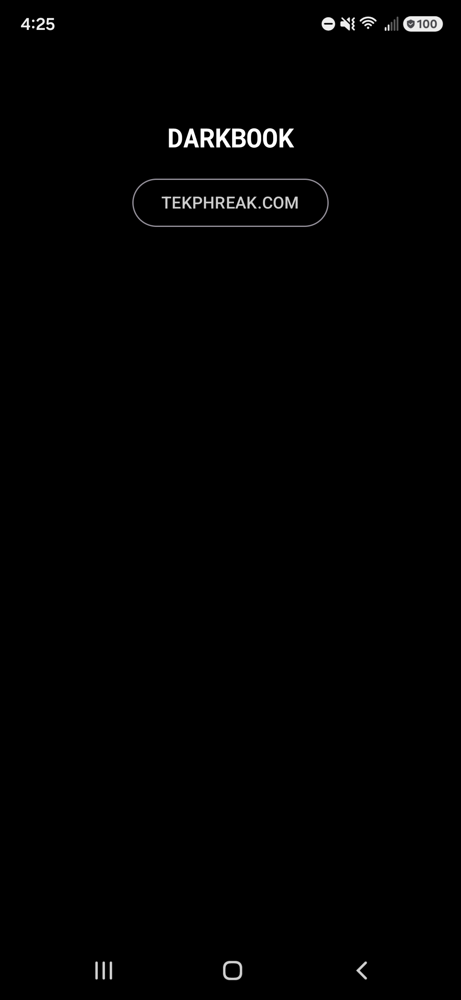
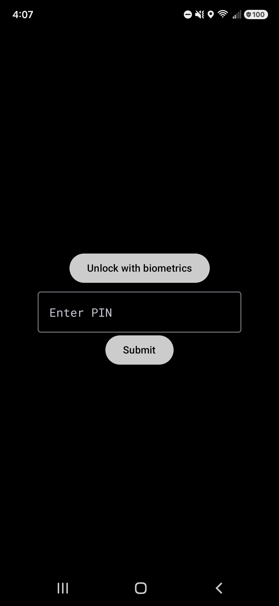
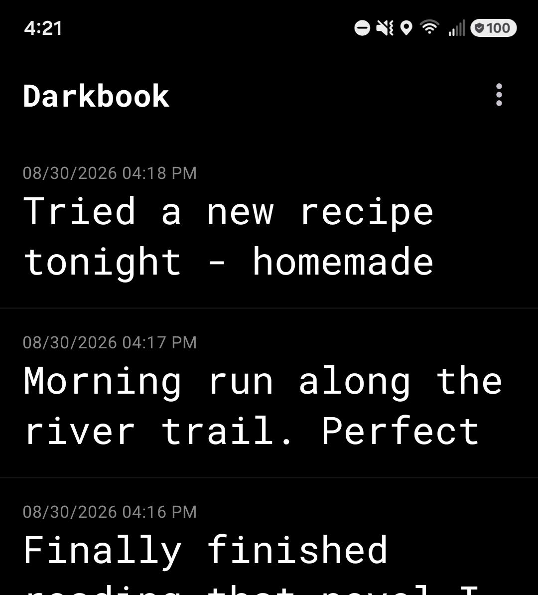
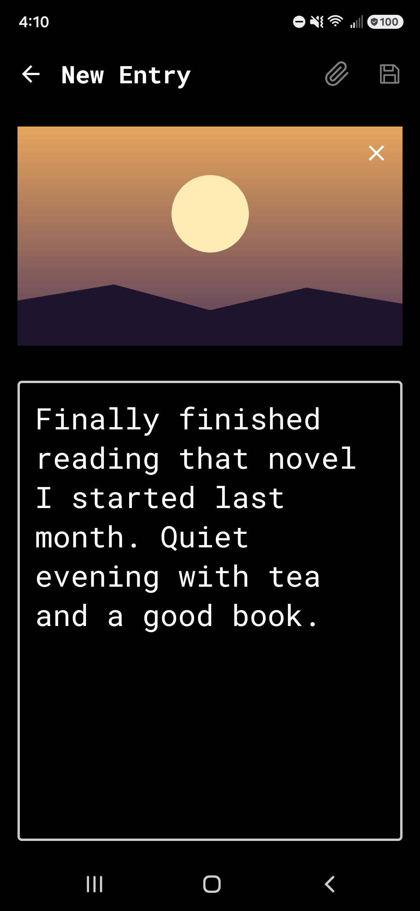
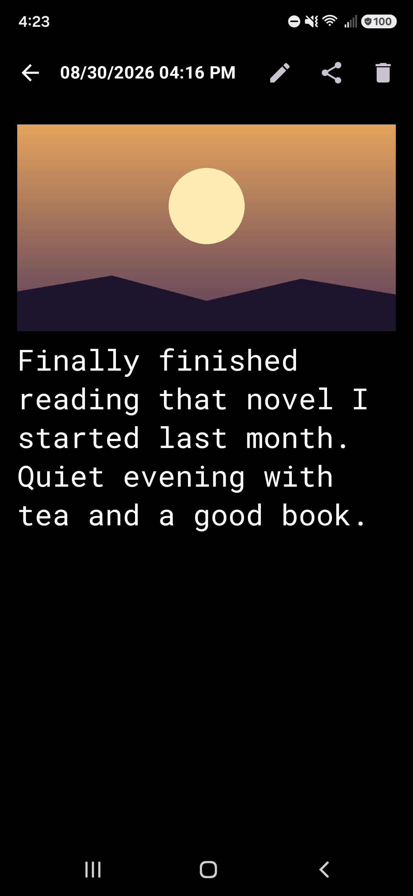
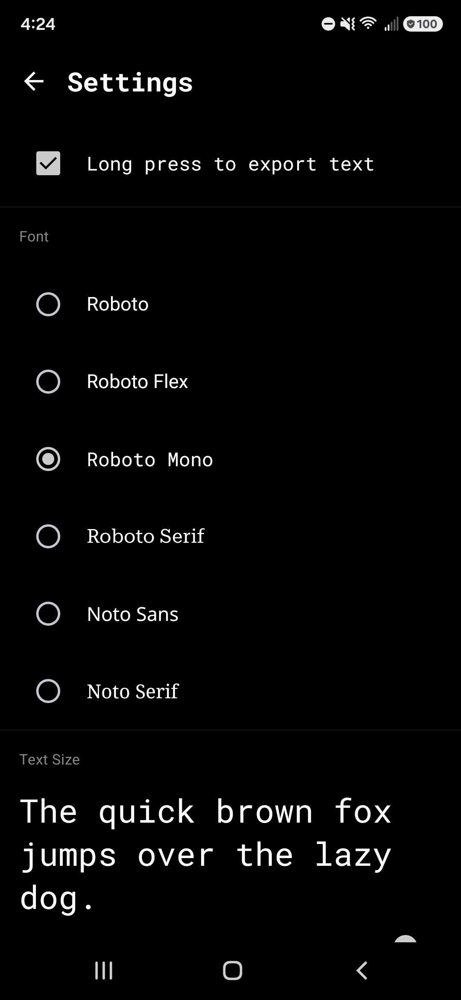
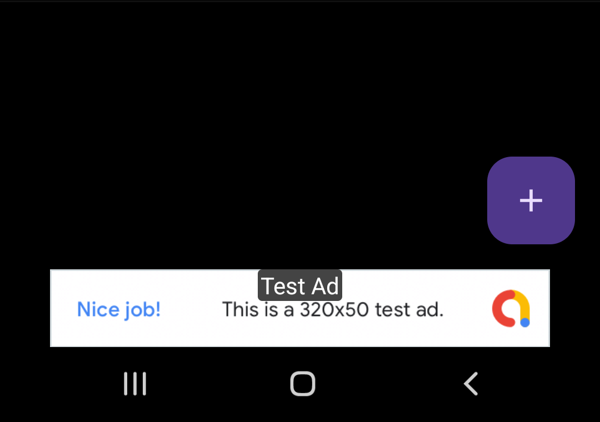

# Darkbook

A private, dark-themed diary app for Android. Everything is local and
encrypted — there's no account, no sync, and no network access except the
two explicit share actions you trigger yourself (plus a banner ad in the
free build — see below).

- Locked behind biometrics (with a salted-hash PIN fallback) on cold start
  and after backgrounding the app
- Entries are stored in a Room database wrapped with SQLCipher; the
  passphrase is random per-install and held in `EncryptedSharedPreferences`
  behind an Android Keystore master key
- Optional image attachment per entry (system Photo Picker, image copied
  into app-private storage and encrypted with `EncryptedFile`)
- Optional location capture, once at creation time, degrading gracefully
  if permission is denied or no fix is available
- Share a specific entry to Threads (with a review-first confirmation
  dialog), or long-press any entry in the list for a generic share sheet
- Six bundled font choices (Roboto, Roboto Flex, Roboto Mono, Roboto Serif,
  Noto Sans, Noto Serif) plus an adjustable text size, applied app-wide from
  Settings
- Two product flavors from one codebase: **free** (`com.tekphreak.darkbook`,
  shown below) carries one AdMob banner on the entry list; **pro**
  (`com.tekphreak.darkbook.pro`) links no ads SDK at all

See [SPEC.md](SPEC.md) for the full design spec, current data model, and a
few interesting bugs found (and fixed) along the way.

## Screenshots

*Free build. Sample entries and image shown here are placeholder content
generated for these screenshots — not real diary data.*

<table>
  <tr>
    <td align="center"><br/>Splash</td>
    <td align="center"><br/>Lock screen</td>
    <td align="center"><br/>Entry list</td>
    <td align="center"><br/>New entry</td>
  </tr>
  <tr>
    <td align="center"><br/>Entry detail</td>
    <td align="center"><br/>Settings</td>
    <td align="center"><br/>Ad banner (free)</td>
    <td></td>
  </tr>
</table>

## Stack

Kotlin, Jetpack Compose (Material3), Room + SQLCipher, AndroidX Biometric,
Play Services location, Google Mobile Ads SDK (free flavor only). Min SDK 26.

## Building

```bash
export JAVA_HOME=/usr/lib/jvm/java-17-openjdk-amd64   # any JDK 17 works
export ANDROID_HOME="$HOME/Android/Sdk"
export PATH="$JAVA_HOME/bin:$ANDROID_HOME/platform-tools:$PATH"

./gradlew assembleDebug                                       # builds both flavors
adb install -r app/build/outputs/apk/free/debug/app-free-debug.apk
adb install -r app/build/outputs/apk/pro/debug/app-pro-debug.apk
```

The free build currently ships Google's official test AdMob IDs — see
[SPEC.md](SPEC.md) for what needs swapping before either flavor ships.

## License

MIT — see [LICENSE](LICENSE).
